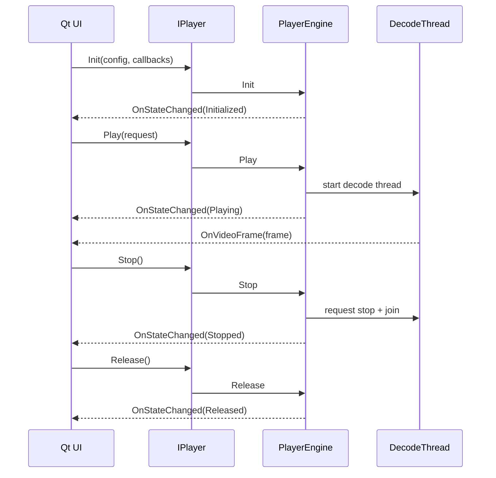

# Level1 Lifecycle Sequence

```mermaid
sequenceDiagram
    participant UI as Qt UI
    participant SDK as IPlayer
    participant Core as PlayerEngine
    participant TH as DecodeThread

    UI->>SDK: Init(config, callbacks)
    SDK->>Core: Init
    Core-->>UI: OnStateChanged(Initialized)

    UI->>SDK: Play(request)
    SDK->>Core: Play
    Core->>TH: start decode thread
    Core-->>UI: OnStateChanged(Playing)
    TH-->>UI: OnVideoFrame(frame)

    UI->>SDK: Stop()
    SDK->>Core: Stop
    Core->>TH: request stop + join
    Core-->>UI: OnStateChanged(Stopped)

    UI->>SDK: Release()
    SDK->>Core: Release
    Core-->>UI: OnStateChanged(Released)
```

